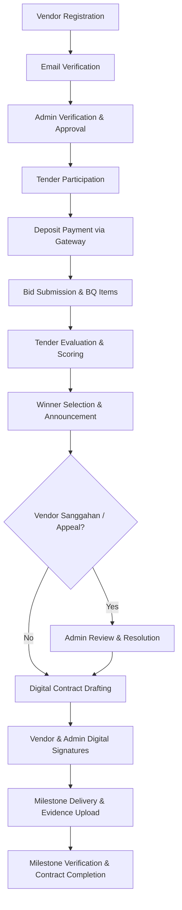
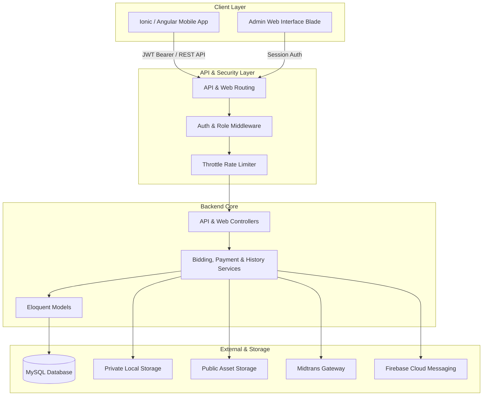
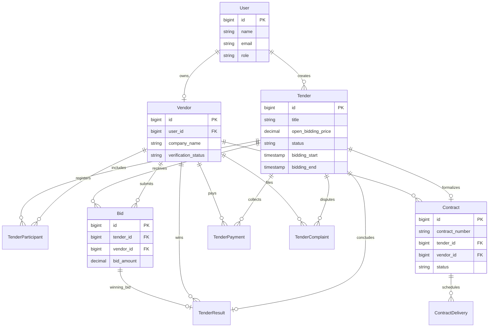

# ZETA E-Procurement

Full-stack e-procurement platform for managing vendor onboarding, tenders, bidding, evaluation, contracts, and delivery workflows.

- **Backend Repository**: [https://github.com/chandra7251/e-tender.git](https://github.com/chandra7251/e-tender.git)
- **Mobile Repository**: [https://github.com/chandra7251/mobile_e-tender](https://github.com/chandra7251/mobile_e-tender)
- **Core Stack**: Laravel, MySQL, REST API, Ionic, Angular, Capacitor

---

## Overview

ZETA E-Procurement is an enterprise procurement system engineered to replace manual and fragmented procurement routines with an automated, auditable process. The platform provides government institutions and enterprises with end-to-end tender governance—covering legal vendor qualification, transparent multi-item bidding, two-envelope scoring evaluation, digital contract execution, milestone delivery verification, and regulatory complaint resolution.

The system adopts a multi-client architecture: an administrative web panel manages operational control and governance, while an Ionic/Angular mobile application powers vendor onboarding, document submissions, real-time bid updates, contract signing, and progress proof uploads. All client channels interface with a centralized Laravel REST API backed by role-based authorization, data consistency controls, and an immutable activity audit log.

---

## Verified Tech Stack

### Backend
- **Framework**: Laravel
- **Language**: PHP
- **Database**: MySQL with Eloquent ORM
- **Authentication**: JWT (`tymon/jwt-auth`) for REST API and session auth for administrative web panel
- **Frontend / Admin Panel**: Blade templates, Tailwind CSS, Vite

### Mobile Client
- **Framework**: Ionic Framework with Angular
- **Runtime Bridge**: Capacitor
- **Platform**: Android Native (`com.vandrafcy.zeta`)

### Integrated Services
- **Document Generation**: PDF generation via Dompdf (contract, tender summary, evaluation reports)
- **Push Notifications**: Firebase Cloud Messaging (Google API Client HTTP v1)
- **Payment Gateway**: Midtrans Snap integration for security deposit payments and automated settlement processing

---

## Business Workflow

The complete procurement lifecycle from onboarding through delivery:



---

## System Architecture



---

## Role Matrix

Granular role-based access control (RBAC) enforced across API and administrative routes:

| Role | Primary Responsibility |
| --- | --- |
| `super_admin` | Global administrative control, system settings, white-label configuration, refunds, audit log inspection |
| `admin` | Vendor submission verification, tender management, winner selection, contract issuance, delivery verification |
| `procurement_manager` | Procurement scheduling, evaluation workflow oversight, contract review |
| `evaluator` | Tender criteria scoring, technical and financial evaluation, participant bid assessment |
| `verifikator` | Vendor document verification, business license checking, qualification audits |
| `auditor` | Read-only access to audit logs, tender transaction histories, financial summaries |
| `vendor` | Mobile-focused participant role for submitting bids, signing contracts, uploading milestone proofs, and filing complaints |

---

## Key Features

### Vendor Portal
- **Self-Service Registration & Verification**: Multi-step registration, email verification, and company legal document uploads.
- **Tender Participation**: Catalog browsing, participation requirements check, and deposit payment gateway processing.
- **Line-Item Bidding**: Bill of Quantities (BQ) unit pricing with client-side and server-side validation.
- **Contract & Delivery Tracking**: In-app digital contract signing and milestone evidence photo uploads to private storage.
- **Sanggahan / Appeal Handling**: Formal complaint filing against tender results within regulatory window periods.

### Procurement & Administration
- **Vendor Lifecycle Review**: Administrative queue for document review, qualification validation, approval, or rejection with mandatory feedback notes.
- **Tender Life Cycle Management**: Announcement publishing, schedule enforcement (`open`, `aanwijzing`, `bidding`, `closed`, `finished`), and status transitions.
- **Two-Envelope Evaluation**: Weighted scoring for technical qualifications and financial bids.
- **Digital Contracts & POs**: Contract number sequencing, SHA-256 document hashing, admin signature validation, and milestone tracking.
- **Audit Logging**: Comprehensive activity tracking capturing user identity, action names, timestamps, and model mutations.

### Security & Hardening
- **JWT & Session Dual Guard**: Stateless JWT authentication with revocation for API consumers alongside CSRF-protected web sessions for staff.
- **Strict Role Hierarchies**: Super admin elevation with granular lockdown on sensitive administrative operations.
- **Webhook Protection**: Server-Side Request Forgery (SSRF) blocklist for private IP ranges, URL scheme validation, and secret hashing.
- **Storage Isolation**: Sensitive delivery evidence stored in private disks with authorized streaming downloads.

---

## Security & Hardening

Hardening measures implemented and validated through regression test suites:
- **Role-Based Authorization**: Route-level and controller-level policies preventing horizontal and vertical privilege escalation.
- **Deposit Payment Protection**: Admin-only refund enforcement with status precondition checks (`finished` tender status, non-winner verification, duplicate refund locks).
- **IDOR Mitigation**: Nested relational ownership checks ensuring vendors can only access and update contracts and deliveries assigned to their tenant.
- **MIME & Size Restrictions**: Upload allowlist enforcement restricting delivery files to verified JPEG/PNG formats below 10 MB with generated unique server filenames.
- **Sensitive Data Filtering**: Model and resource transformers stripping internal gateway payloads (`midtrans_data`), webhook secrets, and authentication keys from public API responses.
- **Bidding Concurrency**: Transactional database locks preventing duplicate bid submissions per vendor on active tenders.

---

## Testing

Comprehensive automated test suites cover business-critical workflows and security boundaries:

- **Backend Test Suite**: 64 tests / 158 assertions (100% pass)
  - `PhaseOneSecurityTest`: Refund authorization, payment summary isolation, delivery IDOR, and private storage upload validation.
  - `PhaseTwoConsistencyTest`: Active `Bid` mapping, BQ item integrity, contract schema synchronization, and AI service domain isolation.
  - `PhaseThreeHardeningTest`: Role middleware guard verification, webhook SSRF protection, secret masking, and CORS compatibility.
  - `PhaseFourCoverageTest`: Complete lifecycle regression covering Auth, Vendor Approval, Participation, Bidding, Contracts, Deliveries, Complaints, and Admin RBAC.
- **Mobile E2E Suite**: 2 Playwright end-to-end tests (100% pass)
  - `zeta-smoke.spec.js`: Automated mobile app launch, onboarding splash walkthrough, and route readiness check.
  - `zeta-e2e.spec.js`: Full interactive vendor lifecycle covering onboarding, credential validation errors, live JWT login, home dashboard data hydration, tender browsing, and authenticated logout.

---

## API Overview

Representative endpoints from the 181-route API catalog:

| Group | Method | Path | Description |
| --- | --- | --- | --- |
| **Auth** | `POST` | `/api/auth/register` | Register new vendor account |
| **Auth** | `POST` | `/api/auth/login` | Authenticate vendor and issue JWT token |
| **Auth** | `POST` | `/api/auth/refresh` | Issue fresh token from active JWT session |
| **Vendor** | `GET` | `/api/vendors/me` | Fetch authenticated vendor profile and status |
| **Vendor** | `POST` | `/api/vendors/documents` | Upload required qualification document |
| **Tender** | `GET` | `/api/tenders` | List active procurement tenders |
| **Tender** | `POST` | `/api/tenders/{id}/participants` | Register vendor participation in an open tender |
| **Bid** | `POST` | `/api/tenders/{id}/penawaran` | Submit financial bid with optional BQ items |
| **Bid** | `PUT` | `/api/tenders/{id}/penawaran/{bid}` | Revise submitted bid prior to bidding deadline |
| **Payment** | `POST` | `/api/payment/deposit` | Generate Midtrans Snap token for tender deposit |
| **Payment** | `POST` | `/api/payment/refund/{id}` | Process deposit refund for non-winning vendor (Admin only) |
| **Contract**| `PATCH`| `/api/contracts/{id}/sign-vendor` | Sign contract electronically as vendor |
| **Delivery**| `PATCH`| `/api/contracts/{id}/deliveries/{dId}/submit` | Upload milestone progress notes and photo evidence |
| **Appeal**  | `POST` | `/api/tenders/{id}/complaints` | Submit tender complaint or appeal within window |
| **Admin**   | `GET`  | `/api/admin/submissions` | Paginated vendor submission queue |

---

## Database Model

Core domain entities and relationships:



---

## Project Structure

```
lelang-2.0/
├── app/
│   ├── Http/
│   │   ├── Controllers/       # API & Admin Controllers
│   │   ├── Middleware/        # JWT, Role & Vendor middleware
│   │   ├── Requests/          # Form request validators
│   │   └── Resources/         # API resource transformers
│   ├── Models/                # Eloquent models
│   └── Services/              # Bidding, Payment, FCM & History services
├── config/                    # Application and package configurations
├── database/
│   ├── factories/             # Model factories for testing
│   ├── migrations/            # Database schema migrations
│   └── seeders/               # Database seeders
├── routes/
│   ├── api.php                # REST API routes
│   └── web.php                # Administrative web routes
├── storage/                   # File uploads and framework cache
└── tests/
    ├── Feature/               # Hardening & regression feature tests
    └── Unit/                  # Unit tests
```

---

## Setup & Local Development

### Prerequisites
- PHP 8.2+ with `pdo_mysql`, `mbstring`, `openssl`, `gd` extensions
- Composer 2.x
- MySQL 8.x
- Node.js 18+ and npm

### 1. Repository Setup
```bash
git clone https://github.com/chandra7251/e-tender.git zeta-backend
cd zeta-backend
composer install
cp .env.example .env
```

### 2. Environment Configuration
Update `.env` with your local database credentials and app details:
```bash
php artisan key:generate
php artisan jwt:secret
```

### 3. Database Migration
```bash
php artisan migrate
php artisan storage:link
```

### 4. Run Application
```bash
# Start backend server
php artisan serve --port=8000

# In a separate terminal, compile frontend assets
npm install
npm run dev
```

---

## Environment Variables

Key configuration variables defined in `.env.example`:

| Variable | Description |
| --- | --- |
| `APP_URL` | Base application URL (e.g. `http://127.0.0.1:8000`) |
| `DB_CONNECTION` | Database driver (`mysql` for local development) |
| `DB_HOST` / `DB_PORT` | Database server address and port |
| `DB_DATABASE` | Database name |
| `DB_USERNAME` / `DB_PASSWORD` | Database credentials |
| `JWT_SECRET` | Secret key used to sign JWT authentication tokens |
| `MIDTRANS_SERVER_KEY` | Midtrans payment gateway server key |
| `MIDTRANS_CLIENT_KEY` | Midtrans payment gateway client key |
| `MIDTRANS_PRODUCTION` | Flag toggle for Midtrans sandbox vs production |
| `FCM_PROJECT_ID` | Firebase project ID for push notification routing |
| `MAIL_MAILER` | Mail driver configuration (`smtp` or `log`) |

---

## Screenshots

Documentation previews organized in `docs/screenshots/`:

| Admin Web Dashboard | Mobile App Dashboard |
| --- | --- |
| `docs/screenshots/admin-dashboard.png` *(pending capture)* |  |

| Tender Details & Bidding | Mobile Tenders Tab |
| --- | --- |
| `docs/screenshots/tender-detail.png` *(pending capture)* |  |

---

## Android Application

- **Application Identifier**: `com.vandrafcy.zeta`
- **Client Architecture**: Ionic Framework + Angular + Capacitor
- **Release Version**: `1.25` (versionCode `25` defined in `android/app/build.gradle`)
- **Play Store Listing**: *TODO: Add verified production Play Store URL once public rollout is completed.*

---

## Production / Release

- **Production API Gateway**: `https://vandrafcy.my.id/api`
- **Mobile Version Reference**: Defined strictly via `android/app/build.gradle`. Old metadata artifacts in intermediate folders are treated as transient build output.

---

## Engineering Notes / Current Limitations

- **JWT Dependency Constraint**: Package `tymon/jwt-auth` is temporarily locked to maintain compatibility with installed symfony/http-foundation constraints.
- **Webhook Envelope Versioning**: The webhook event dispatch system uses single-payload signatures; an upcoming revision will introduce standardized signature envelope headers for enterprise consumers.
- **Historical Data Cleansing**: Payment record foreign keys require historical data cleansing prior to applying cascading database constraints on legacy records.

---

## Author

- **Author**: Chandra Aditiya Putra ([chandra7251](https://github.com/chandra7251))
